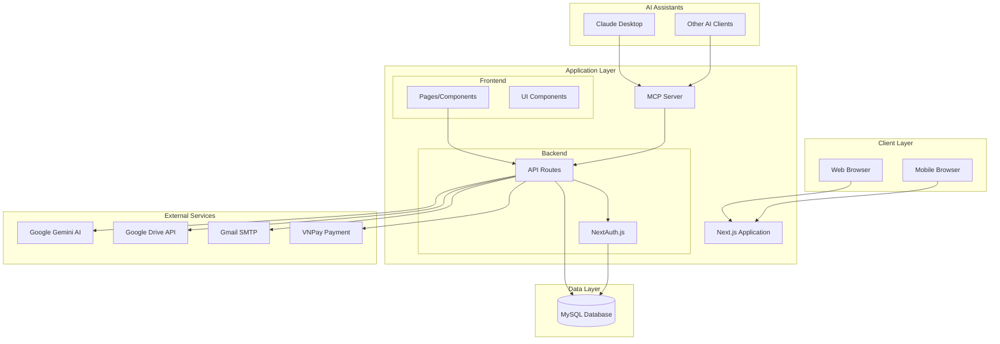
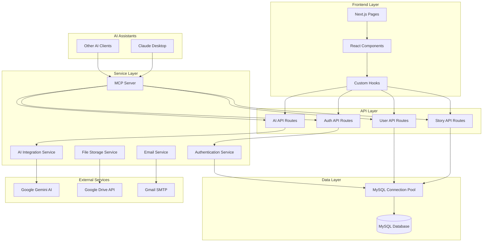
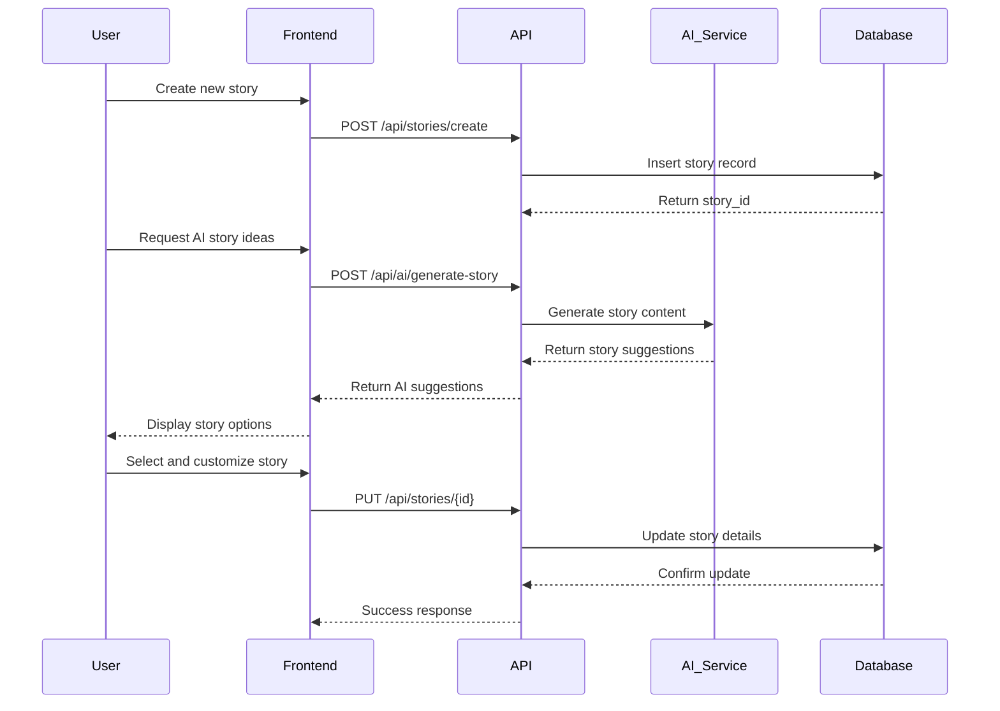
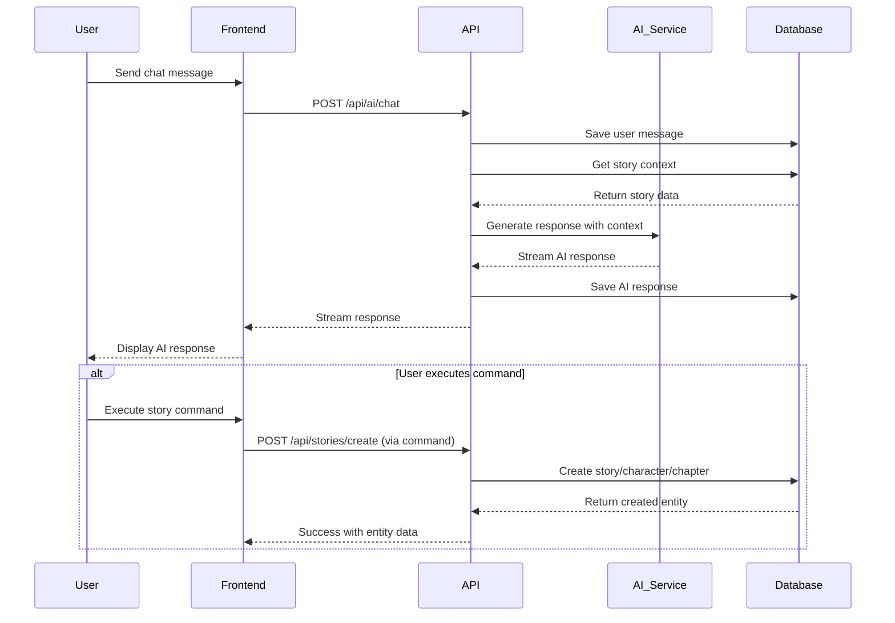
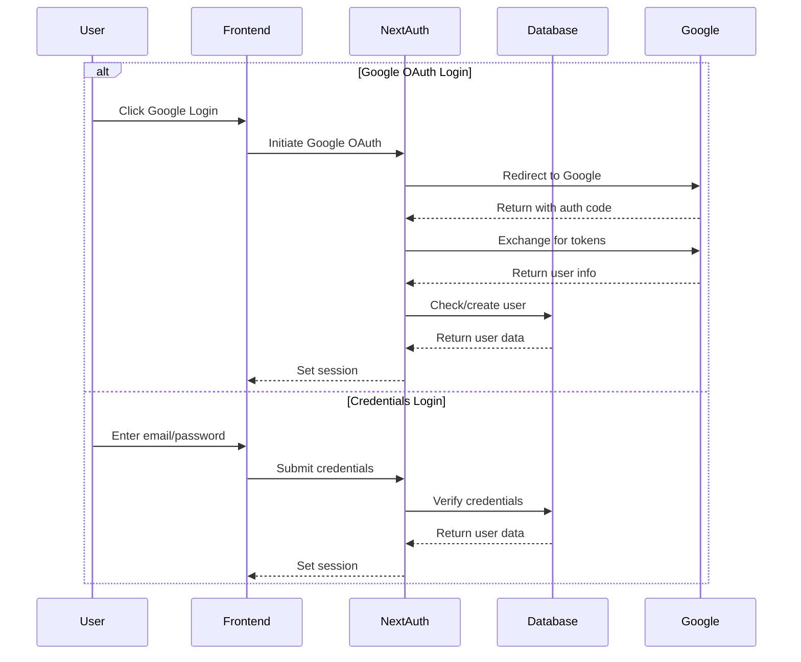
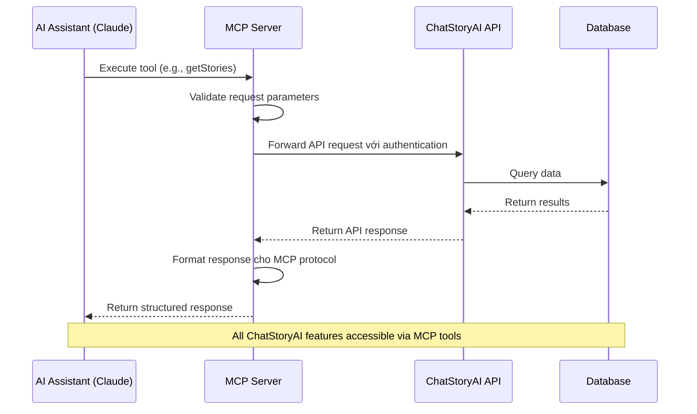

# ChatStoryAI Architecture Document

## Introduction

Tài liệu này mô tả tổng quan kiến trúc dự án cho **ChatStoryAI**, bao gồm hệ thống backend, các dịch vụ chia sẻ, và các vấn đề không liên quan đến UI cụ thể. Mục tiêu chính là phục vụ như bản thiết kế kiến trúc hướng dẫn cho việc phát triển được điều khiển bởi AI, đảm bảo tính nhất quán và tuân thủ các mẫu và công nghệ đã chọn.

**Mối quan hệ với Kiến trúc Frontend:**
Vì dự án bao gồm một giao diện người dùng quan trọng, một Tài liệu Kiến trúc Frontend riêng biệt sẽ chi tiết thiết kế cụ thể cho frontend và PHẢI được sử dụng kết hợp với tài liệu này. Các lựa chọn công nghệ cốt lõi được ghi lại ở đây (xem "Tech Stack") là quyết định cho toàn bộ dự án, bao gồm cả các thành phần frontend.

### Starter Template hoặc Dự án Hiện có

**Phân tích dự án hiện có:**

Dự án ChatStoryAI là một **brownfield project** đã được phát triển với:

- **Framework chính**: Next.js (Full-stack React framework)
- **Cấu trúc**: Monolithic Next.js application với API routes
- **Database**: MySQL với kết nối trực tiếp
- **AI Integration**: Google Gemini API cho tính năng chat và tạo nội dung
- **Authentication**: NextAuth.js
- **Containerization**: Docker với docker-compose
- **Cloud Storage**: Google Drive API

**Ràng buộc từ codebase hiện có:**

- Đã có cấu trúc thư mục Next.js với `src/app` directory structure
- Database schema đã được thiết lập cho stories, characters, chapters, dialogues
- API endpoints đã được implement trong `src/app/api/`
- UI components sử dụng Radix UI + TailwindCSS
- TypeScript configuration đã được setup

**Quyết định kiến trúc**: Tiếp tục phát triển trên nền tảng Next.js hiện có, tối ưu hóa và mở rộng các tính năng mà không thay đổi cấu trúc cốt lõi.

**Cập nhật mới nhất**: Đã thêm MCP (Model Context Protocol) Server để tích hợp với AI assistants như Claude Desktop, mở rộng khả năng tương tác với hệ thống qua giao thức chuẩn.

### Change Log

| Date       | Version | Description                                    | Author              |
| ---------- | ------- | ---------------------------------------------- | ------------------- |
| 2025-01-18 | 1.0     | Tài liệu kiến trúc ban đầu từ codebase hiện có | Winston (Architect) |
| 2025-01-18 | 1.1     | Cập nhật kiến trúc với MCP Server integration  | Winston (Architect) |

## High Level Architecture

### Technical Summary

ChatStoryAI sử dụng kiến trúc **Monolithic Full-Stack với MCP Integration** với Next.js làm framework chính, tích hợp AI services để tạo nội dung truyện tự động. Hệ thống bao gồm frontend React, API routes tích hợp, MCP Server cho AI assistant integration, MySQL database, và các external services (Google Gemini AI, Google Drive). Kiến trúc này hỗ trợ các mục tiêu PRD về việc tạo truyện với AI, quản lý nội dung, và chia sẻ cộng đồng thông qua một platform thống nhất và dễ bảo trì, đồng thời cho phép tương tác qua AI assistants như Claude Desktop.

### High Level Overview

1. **Architectural Style**: **Monolithic Full-Stack Application với MCP Integration**

   - Single Next.js application handling both frontend và backend
   - API routes tích hợp trong cùng codebase
   - MCP Server cho AI assistant integration
   - Shared components và utilities

2. **Repository Structure**: **Monorepo với MCP Extension**

   - Single repository chứa toàn bộ application
   - Organized theo Next.js App Router structure
   - Separate MCP server trong `/mcp` directory
   - Shared types và utilities trong `src/lib`

3. **Service Architecture**: **Monolithic với External Services và MCP Layer**

   - Core application logic trong Next.js
   - MCP Server cho AI assistant integration (Claude Desktop, etc.)
   - External AI services (Google Gemini)
   - External storage (Google Drive API)
   - MySQL database cho persistent data

4. **User Interaction Flow**:

   - User authentication qua NextAuth.js (Google OAuth + Credentials)
   - Story creation và management qua web interface
   - AI-powered content generation qua integrated chat
   - Real-time collaboration features

5. **Key Architectural Decisions**:
   - **Next.js Full-Stack**: Simplifies deployment và development
   - **MySQL**: Relational data phù hợp với story/character relationships
   - **Google Gemini**: Advanced AI capabilities cho content generation
   - **Docker**: Containerized deployment cho consistency

### High Level Project Diagram



### Architectural and Design Patterns

- **Full-Stack Monolith với MCP Integration**: Next.js application với integrated API routes và MCP Server - _Rationale:_ Đơn giản hóa development và deployment, đồng thời mở rộng khả năng tích hợp với AI assistants
- **Model Context Protocol (MCP)**: Standardized protocol cho AI assistant integration - _Rationale:_ Cho phép AI assistants như Claude Desktop tương tác trực tiếp với hệ thống qua giao thức chuẩn
- **Repository Pattern**: Abstraction layer cho database access - _Rationale:_ Tách biệt business logic khỏi data access, dễ testing và maintenance
- **Service Layer Pattern**: Tách biệt business logic thành services - _Rationale:_ Tổ chức code tốt hơn, reusability cao
- **API-First Design**: RESTful APIs với OpenAPI documentation - _Rationale:_ Hỗ trợ future mobile apps và third-party integrations
- **Event-Driven UI**: React state management với hooks - _Rationale:_ Responsive UI với real-time updates
- **Authentication Middleware**: NextAuth.js cho session management - _Rationale:_ Secure và standardized authentication flow

## Tech Stack

### Cloud Infrastructure

- **Provider:** Docker Containerization (Local/Cloud agnostic)
- **Key Services:** MySQL Database, File Storage (Google Drive), Email (Gmail SMTP)
- **Deployment Regions:** Configurable based on deployment target

### Technology Stack Table

| Category             | Technology        | Version   | Purpose                      | Rationale                                                        |
| -------------------- | ----------------- | --------- | ---------------------------- | ---------------------------------------------------------------- |
| **Runtime**          | Node.js           | 20.x      | JavaScript runtime           | LTS version, excellent performance, wide ecosystem               |
| **Language**         | TypeScript        | 5.x       | Primary development language | Type safety, better developer experience, maintainability        |
| **Framework**        | Next.js           | 15.3.3    | Full-stack React framework   | SSR/SSG capabilities, API routes, excellent developer experience |
| **Database**         | MySQL             | 8.0       | Primary database             | Relational data model fits story/character relationships         |
| **ORM/Query**        | mysql2            | 3.12.0    | Database driver              | Direct SQL queries, performance, flexibility                     |
| **Authentication**   | NextAuth.js       | 4.24.11   | Authentication system        | OAuth integration, session management, security                  |
| **AI Service**       | Google Gemini     | 2.5-flash | Content generation AI        | Advanced language model, multimodal capabilities                 |
| **UI Framework**     | React             | 19.0.0    | Frontend framework           | Component-based architecture, large ecosystem                    |
| **Styling**          | TailwindCSS       | 3.4.1     | CSS framework                | Utility-first, rapid development, consistent design              |
| **UI Components**    | Radix UI          | Various   | Accessible components        | Accessibility-first, customizable, well-tested                   |
| **State Management** | React Hooks       | Built-in  | Client state management      | Simple, built-in solution, sufficient for current needs          |
| **File Storage**     | Google Drive API  | v3        | File and image storage       | Free tier, reliable, easy integration                            |
| **Email Service**    | Gmail SMTP        | -         | Transactional emails         | Reliable, free tier, easy setup                                  |
| **Payment**          | VNPay             | 1.6.1     | Payment processing           | Local Vietnam payment gateway                                    |
| **Containerization** | Docker            | Latest    | Application containerization | Consistent deployment, environment isolation                     |
| **MCP Integration**  | MCP SDK           | 1.12.0    | AI assistant integration     | Standardized protocol cho AI assistant communication             |
| **Development**      | ESLint + Prettier | Latest    | Code quality and formatting  | Code consistency, error prevention                               |

## Data Models

### Core Business Entities

Dựa trên phân tích codebase, ChatStoryAI có các entity chính sau:

#### User

**Purpose:** Quản lý thông tin người dùng và authentication

**Key Attributes:**

- user_id: INT (Primary Key) - Unique identifier
- username: VARCHAR(255) - Display name
- email: VARCHAR(255) - Authentication và communication
- user_password: VARCHAR(255) - Hashed password (nullable cho Google users)
- avatar: VARCHAR(255) - Profile image URL
- has_badge: BOOLEAN - Premium user indicator
- created_at: TIMESTAMP - Account creation time

**Relationships:**

- One-to-Many với Stories (user tạo nhiều stories)
- One-to-Many với AI Chat History
- One-to-Many với API Keys

#### Story

**Purpose:** Core entity cho việc quản lý truyện và nội dung

**Key Attributes:**

- story_id: INT (Primary Key) - Unique identifier
- title: VARCHAR(255) - Story title
- description: TEXT - Story summary/description
- main_category: VARCHAR(100) - Primary genre
- status: ENUM('draft', 'published', 'archived') - Publication status
- cover_image: VARCHAR(255) - Cover image URL
- view_count: INT - Reading statistics
- favorite_count: INT - User engagement metrics
- created_at/updated_at: TIMESTAMP - Audit trail

**Relationships:**

- Many-to-One với User (story belongs to user)
- One-to-Many với Chapters
- One-to-Many với Characters
- One-to-Many với Outlines
- Many-to-Many với Tags

#### Chapter

**Purpose:** Tổ chức nội dung truyện theo chương

**Key Attributes:**

- chapter_id: INT (Primary Key) - Unique identifier
- story_id: INT (Foreign Key) - Parent story
- title: VARCHAR(255) - Chapter title
- summary: TEXT - Chapter summary
- status: VARCHAR(50) - Chapter status
- order_number: INT - Chapter sequence
- created_at/updated_at: TIMESTAMP - Audit trail

**Relationships:**

- Many-to-One với Story
- One-to-Many với Dialogues
- One-to-Many với AI Generated Dialogues

#### Character

**Purpose:** Quản lý nhân vật trong truyện

**Key Attributes:**

- character_id: INT (Primary Key) - Unique identifier
- story_id: INT (Foreign Key) - Parent story
- name: VARCHAR(255) - Character name
- description: TEXT - Character description
- gender: VARCHAR(50) - Character gender
- personality: TEXT - Personality traits
- appearance: TEXT - Physical description
- background: TEXT - Character backstory
- role: VARCHAR(100) - Character role in story
- avatar_image: VARCHAR(255) - Character avatar

**Relationships:**

- Many-to-One với Story
- Referenced trong Dialogues

#### Dialogue

**Purpose:** Quản lý hội thoại và nội dung chapter

**Key Attributes:**

- dialogue_id: INT (Primary Key) - Unique identifier
- chapter_id: INT (Foreign Key) - Parent chapter
- content: TEXT - Dialogue content
- type: ENUM('dialogue', 'aside') - Content type
- character_name: VARCHAR(255) - Speaking character
- order_number: INT - Sequence trong chapter

**Relationships:**

- Many-to-One với Chapter
- References Character (by name)

#### AI_Generated_Dialogues

**Purpose:** Lưu trữ nội dung AI tạo ra trước khi được approve

**Key Attributes:**

- dialogue_id: INT (Primary Key) - Unique identifier
- story_id: INT (Foreign Key) - Parent story
- chapter_id: INT (Foreign Key) - Parent chapter
- content: TEXT - AI generated content
- type: VARCHAR(50) - Content type
- character_names: JSON - Array of character names
- is_added: BOOLEAN - Approval status

**Relationships:**

- Many-to-One với Story
- Many-to-One với Chapter

## Components

### Core Application Components

Dựa trên kiến trúc Next.js và phân tích codebase, hệ thống được tổ chức thành các component chính:

#### Web Application Layer

**Responsibility:** Frontend user interface và user experience

**Key Interfaces:**

- React components với TypeScript
- Next.js App Router pages
- Client-side state management với React hooks
- Responsive design với TailwindCSS

**Dependencies:** React, Next.js, TailwindCSS, Radix UI

**Technology Stack:** Next.js 15.3.3, React 19.0.0, TypeScript 5.x

#### API Layer

**Responsibility:** Backend business logic và data processing

**Key Interfaces:**

- RESTful API endpoints trong `/api` routes
- Request/response handling với NextResponse
- Authentication middleware
- Data validation và error handling

**Dependencies:** Next.js API routes, NextAuth.js, MySQL connection pool

**Technology Stack:** Next.js API Routes, NextAuth.js 4.24.11

#### Authentication Service

**Responsibility:** User authentication và session management

**Key Interfaces:**

- NextAuth.js configuration
- Google OAuth provider
- Credentials provider cho local accounts
- Session management và JWT tokens

**Dependencies:** NextAuth.js, Google OAuth, MySQL user table

**Technology Stack:** NextAuth.js 4.24.11, Google OAuth 2.0

#### Database Access Layer

**Responsibility:** Data persistence và query execution

**Key Interfaces:**

- MySQL connection pool
- Direct SQL queries với mysql2
- Transaction management
- Connection pooling và error handling

**Dependencies:** MySQL 8.0, mysql2 driver

**Technology Stack:** MySQL 8.0, mysql2 3.12.0

#### AI Integration Service

**Responsibility:** AI-powered content generation

**Key Interfaces:**

- Google Gemini API integration
- Prompt engineering và response processing
- Streaming responses cho real-time chat
- Content moderation và safety settings

**Dependencies:** Google Gemini API, custom prompt templates

**Technology Stack:** Google Gemini 2.5-flash, @google/generative-ai 0.22.0

#### File Storage Service

**Responsibility:** File upload và storage management

**Key Interfaces:**

- Google Drive API integration
- File upload/download operations
- Image processing và optimization
- Access control và sharing permissions

**Dependencies:** Google Drive API, Google Service Account

**Technology Stack:** Google Drive API v3, googleapis 144.0.0

#### Email Service

**Responsibility:** Transactional email delivery

**Key Interfaces:**

- Gmail SMTP integration
- Email template rendering
- Delivery status tracking
- Error handling và retry logic

**Dependencies:** Gmail SMTP, nodemailer

**Technology Stack:** Gmail SMTP, nodemailer 6.10.0

#### MCP Server

**Responsibility:** AI assistant integration qua Model Context Protocol

**Key Interfaces:**

- MCP protocol implementation
- Tool registration và execution
- API proxy cho ChatStoryAI endpoints
- Authentication và authorization forwarding

**Dependencies:** @modelcontextprotocol/sdk, axios, zod

**Technology Stack:** MCP SDK 1.12.0, TypeScript 5.8.3, Node.js 20.x

### Component Diagrams



## External APIs

### Google Gemini AI API

- **Purpose:** AI-powered content generation cho stories, characters, dialogues
- **Documentation:** https://ai.google.dev/docs
- **Base URL(s):** https://generativelanguage.googleapis.com
- **Authentication:** API Key authentication
- **Rate Limits:** Requests per minute based on API tier

**Key Endpoints Used:**

- `POST /v1beta/models/gemini-2.5-flash-preview-05-20:generateContent` - Content generation
- `POST /v1beta/models/gemini-2.5-flash-preview-05-20:streamGenerateContent` - Streaming responses

**Integration Notes:** Sử dụng custom prompts cho story creation, character development, và dialogue generation. Safety settings được configure để allow creative content.

### Google Drive API

- **Purpose:** File storage cho cover images, character avatars, và user uploads
- **Documentation:** https://developers.google.com/drive/api
- **Base URL(s):** https://www.googleapis.com/drive/v3
- **Authentication:** Service Account với JSON key
- **Rate Limits:** 1000 requests per 100 seconds per user

**Key Endpoints Used:**

- `POST /files` - File upload
- `GET /files/{fileId}` - File metadata
- `PATCH /files/{fileId}` - Update file permissions

**Integration Notes:** Files được store trong dedicated Google Drive folder với public read permissions cho images.

### Gmail SMTP

- **Purpose:** Transactional emails cho password reset, notifications
- **Documentation:** https://support.google.com/mail/answer/7126229
- **Base URL(s):** smtp.gmail.com:587
- **Authentication:** App Password authentication
- **Rate Limits:** 500 emails per day for free accounts

**Key Operations:**

- Password reset emails
- Account verification emails
- Notification emails

**Integration Notes:** Sử dụng nodemailer với Gmail SMTP, requires App Password setup.

### VNPay Payment Gateway

- **Purpose:** Payment processing cho premium features
- **Documentation:** https://sandbox.vnpayment.vn/apis/
- **Base URL(s):** https://sandbox.vnpayment.vn (sandbox), https://vnpayment.vn (production)
- **Authentication:** TMN Code và Hash Secret
- **Rate Limits:** Based on merchant agreement

**Key Endpoints Used:**

- `POST /paymentv2/vpcpay.html` - Create payment
- `GET /merchant_webapi/api/transaction` - Query transaction

**Integration Notes:** Local Vietnam payment gateway, supports multiple payment methods including banking và e-wallets.

### Model Context Protocol (MCP)

- **Purpose:** Standardized integration với AI assistants như Claude Desktop
- **Documentation:** https://modelcontextprotocol.io/docs
- **Base URL(s):** Local stdio transport
- **Authentication:** API key forwarding từ MCP client
- **Rate Limits:** Inherited từ underlying ChatStoryAI API

**Key Tools Available:**

- Story management (CRUD operations)
- Chapter management
- Character management
- Dialogue management
- Outline management
- Bookmark và reading history
- Categories và tags

**Integration Notes:** MCP Server acts như một proxy layer, forwarding requests từ AI assistants đến ChatStoryAI API endpoints với proper authentication và error handling.

## Core Workflows

### Story Creation Workflow



### AI Chat Workflow



### User Authentication Workflow



### MCP Integration Workflow



## REST API Spec

```yaml
openapi: 3.0.0
info:
  title: ChatStoryAI API
  version: 1.0.0
  description: API for ChatStoryAI story creation platform with AI integration
servers:
  - url: http://localhost:3000/api
    description: Development server
  - url: https://chatstoryai.com/api
    description: Production server

paths:
  /stories:
    get:
      summary: Get user stories
      tags: [Stories]
      security:
        - sessionAuth: []
      parameters:
        - name: status
          in: query
          schema:
            type: string
            enum: [draft, published, archived]
        - name: page
          in: query
          schema:
            type: integer
            default: 1
        - name: limit
          in: query
          schema:
            type: integer
            default: 10
      responses:
        200:
          description: List of stories
          content:
            application/json:
              schema:
                type: object
                properties:
                  stories:
                    type: array
                    items:
                      $ref: "#/components/schemas/Story"
                  pagination:
                    $ref: "#/components/schemas/Pagination"

    post:
      summary: Create new story
      tags: [Stories]
      security:
        - sessionAuth: []
      requestBody:
        required: true
        content:
          multipart/form-data:
            schema:
              type: object
              properties:
                title:
                  type: string
                description:
                  type: string
                mainCategoryId:
                  type: integer
                tagIds:
                  type: array
                  items:
                    type: integer
      responses:
        201:
          description: Story created successfully
          content:
            application/json:
              schema:
                $ref: "#/components/schemas/Story"

  /stories/{id}:
    get:
      summary: Get story by ID
      tags: [Stories]
      security:
        - sessionAuth: []
      parameters:
        - name: id
          in: path
          required: true
          schema:
            type: integer
      responses:
        200:
          description: Story details
          content:
            application/json:
              schema:
                $ref: "#/components/schemas/StoryDetail"

    put:
      summary: Update story
      tags: [Stories]
      security:
        - sessionAuth: []
      parameters:
        - name: id
          in: path
          required: true
          schema:
            type: integer
      requestBody:
        required: true
        content:
          application/json:
            schema:
              $ref: "#/components/schemas/StoryUpdate"
      responses:
        200:
          description: Story updated successfully

  /ai/chat:
    post:
      summary: Chat with AI assistant
      tags: [AI]
      security:
        - sessionAuth: []
      requestBody:
        required: true
        content:
          application/json:
            schema:
              type: object
              properties:
                message:
                  type: string
                chatId:
                  type: integer
                storyId:
                  type: integer
                images:
                  type: array
                  items:
                    type: string
      responses:
        200:
          description: AI response
          content:
            application/json:
              schema:
                type: object
                properties:
                  response:
                    type: string
                  chatId:
                    type: integer

components:
  schemas:
    Story:
      type: object
      properties:
        story_id:
          type: integer
        title:
          type: string
        description:
          type: string
        main_category:
          type: string
        status:
          type: string
          enum: [draft, published, archived]
        cover_image:
          type: string
        view_count:
          type: integer
        favorite_count:
          type: integer
        created_at:
          type: string
          format: date-time
        updated_at:
          type: string
          format: date-time

    StoryDetail:
      allOf:
        - $ref: "#/components/schemas/Story"
        - type: object
          properties:
            chapters:
              type: array
              items:
                $ref: "#/components/schemas/Chapter"
            characters:
              type: array
              items:
                $ref: "#/components/schemas/Character"
            tags:
              type: array
              items:
                type: string

    Chapter:
      type: object
      properties:
        chapter_id:
          type: integer
        title:
          type: string
        summary:
          type: string
        status:
          type: string
        order_number:
          type: integer

    Character:
      type: object
      properties:
        character_id:
          type: integer
        name:
          type: string
        description:
          type: string
        gender:
          type: string
        personality:
          type: string
        appearance:
          type: string
        role:
          type: string

    Pagination:
      type: object
      properties:
        page:
          type: integer
        limit:
          type: integer
        total:
          type: integer
        totalPages:
          type: integer

  securitySchemes:
    sessionAuth:
      type: apiKey
      in: cookie
      name: next-auth.session-token
```

## Database Schema

### MySQL Schema Definition

```sql
-- Users table
CREATE TABLE users (
  user_id INT NOT NULL AUTO_INCREMENT,
  username VARCHAR(255) NOT NULL,
  email VARCHAR(255) NOT NULL UNIQUE,
  user_password VARCHAR(255) DEFAULT NULL,
  avatar VARCHAR(255) DEFAULT '/default-user.webp',
  drive_file_id VARCHAR(255) DEFAULT NULL,
  has_badge TINYINT(1) DEFAULT '0',
  created_at TIMESTAMP NOT NULL DEFAULT CURRENT_TIMESTAMP,
  updated_at TIMESTAMP NOT NULL DEFAULT CURRENT_TIMESTAMP ON UPDATE CURRENT_TIMESTAMP,
  PRIMARY KEY (user_id),
  INDEX idx_email (email),
  INDEX idx_username (username)
) ENGINE=InnoDB DEFAULT CHARSET=utf8mb4 COLLATE=utf8mb4_unicode_ci;

-- Stories table
CREATE TABLE stories (
  story_id INT NOT NULL AUTO_INCREMENT,
  user_id INT NOT NULL,
  title VARCHAR(255) NOT NULL,
  description TEXT,
  main_category VARCHAR(100) NOT NULL,
  status ENUM('draft', 'published', 'archived') DEFAULT 'draft',
  cover_image VARCHAR(255) DEFAULT NULL,
  cover_file_id VARCHAR(255) DEFAULT NULL,
  view_count INT DEFAULT '0',
  favorite_count INT DEFAULT '0',
  created_at TIMESTAMP NOT NULL DEFAULT CURRENT_TIMESTAMP,
  updated_at TIMESTAMP NOT NULL DEFAULT CURRENT_TIMESTAMP ON UPDATE CURRENT_TIMESTAMP,
  PRIMARY KEY (story_id),
  FOREIGN KEY (user_id) REFERENCES users(user_id) ON DELETE CASCADE,
  INDEX idx_user_id (user_id),
  INDEX idx_status (status),
  INDEX idx_main_category (main_category),
  INDEX idx_created_at (created_at)
) ENGINE=InnoDB DEFAULT CHARSET=utf8mb4 COLLATE=utf8mb4_unicode_ci;

-- Story chapters table
CREATE TABLE story_chapters (
  chapter_id INT NOT NULL AUTO_INCREMENT,
  story_id INT NOT NULL,
  title VARCHAR(255) NOT NULL,
  summary TEXT,
  status VARCHAR(50) DEFAULT 'draft',
  order_number INT NOT NULL,
  created_at TIMESTAMP NOT NULL DEFAULT CURRENT_TIMESTAMP,
  updated_at TIMESTAMP NOT NULL DEFAULT CURRENT_TIMESTAMP ON UPDATE CURRENT_TIMESTAMP,
  PRIMARY KEY (chapter_id),
  FOREIGN KEY (story_id) REFERENCES stories(story_id) ON DELETE CASCADE,
  INDEX idx_story_id (story_id),
  INDEX idx_order_number (order_number),
  UNIQUE KEY unique_story_order (story_id, order_number)
) ENGINE=InnoDB DEFAULT CHARSET=utf8mb4 COLLATE=utf8mb4_unicode_ci;

-- Story characters table
CREATE TABLE story_characters (
  character_id INT NOT NULL AUTO_INCREMENT,
  story_id INT NOT NULL,
  name VARCHAR(255) NOT NULL,
  description TEXT,
  gender VARCHAR(50),
  birthday VARCHAR(50),
  height VARCHAR(50),
  weight VARCHAR(50),
  personality TEXT,
  appearance TEXT,
  background TEXT,
  role VARCHAR(100),
  avatar_image VARCHAR(255),
  avatar_file_id VARCHAR(255),
  created_at TIMESTAMP NOT NULL DEFAULT CURRENT_TIMESTAMP,
  updated_at TIMESTAMP NOT NULL DEFAULT CURRENT_TIMESTAMP ON UPDATE CURRENT_TIMESTAMP,
  PRIMARY KEY (character_id),
  FOREIGN KEY (story_id) REFERENCES stories(story_id) ON DELETE CASCADE,
  INDEX idx_story_id (story_id),
  INDEX idx_name (name)
) ENGINE=InnoDB DEFAULT CHARSET=utf8mb4 COLLATE=utf8mb4_unicode_ci;

-- Chapter dialogues table
CREATE TABLE chapter_dialogues (
  dialogue_id INT NOT NULL AUTO_INCREMENT,
  chapter_id INT NOT NULL,
  content TEXT NOT NULL,
  type ENUM('dialogue', 'aside') DEFAULT 'dialogue',
  character_name VARCHAR(255),
  order_number INT NOT NULL,
  created_at TIMESTAMP NOT NULL DEFAULT CURRENT_TIMESTAMP,
  updated_at TIMESTAMP NOT NULL DEFAULT CURRENT_TIMESTAMP ON UPDATE CURRENT_TIMESTAMP,
  PRIMARY KEY (dialogue_id),
  FOREIGN KEY (chapter_id) REFERENCES story_chapters(chapter_id) ON DELETE CASCADE,
  INDEX idx_chapter_id (chapter_id),
  INDEX idx_order_number (order_number),
  INDEX idx_character_name (character_name)
) ENGINE=InnoDB DEFAULT CHARSET=utf8mb4 COLLATE=utf8mb4_unicode_ci;

-- AI generated dialogues table
CREATE TABLE ai_generated_dialogues (
  dialogue_id INT NOT NULL AUTO_INCREMENT,
  story_id INT NOT NULL,
  chapter_id INT NOT NULL,
  content TEXT NOT NULL,
  type VARCHAR(50) DEFAULT 'dialogue',
  character_names JSON,
  is_added TINYINT(1) DEFAULT '0',
  created_at TIMESTAMP NOT NULL DEFAULT CURRENT_TIMESTAMP,
  PRIMARY KEY (dialogue_id),
  FOREIGN KEY (story_id) REFERENCES stories(story_id) ON DELETE CASCADE,
  FOREIGN KEY (chapter_id) REFERENCES story_chapters(chapter_id) ON DELETE CASCADE,
  INDEX idx_story_id (story_id),
  INDEX idx_chapter_id (chapter_id),
  INDEX idx_is_added (is_added)
) ENGINE=InnoDB DEFAULT CHARSET=utf8mb4 COLLATE=utf8mb4_unicode_ci;

-- AI chat history table
CREATE TABLE ai_chat_history (
  chat_id INT NOT NULL AUTO_INCREMENT,
  user_id INT NOT NULL,
  title VARCHAR(255) NOT NULL,
  created_at TIMESTAMP NOT NULL DEFAULT CURRENT_TIMESTAMP,
  updated_at TIMESTAMP NOT NULL DEFAULT CURRENT_TIMESTAMP ON UPDATE CURRENT_TIMESTAMP,
  PRIMARY KEY (chat_id),
  FOREIGN KEY (user_id) REFERENCES users(user_id) ON DELETE CASCADE,
  INDEX idx_user_id (user_id),
  INDEX idx_updated_at (updated_at)
) ENGINE=InnoDB DEFAULT CHARSET=utf8mb4 COLLATE=utf8mb4_unicode_ci;

-- AI chat messages table
CREATE TABLE ai_chat_messages (
  message_id INT NOT NULL AUTO_INCREMENT,
  chat_id INT NOT NULL,
  role ENUM('user', 'assistant') NOT NULL,
  content TEXT NOT NULL,
  created_at TIMESTAMP NOT NULL DEFAULT CURRENT_TIMESTAMP,
  PRIMARY KEY (message_id),
  FOREIGN KEY (chat_id) REFERENCES ai_chat_history(chat_id) ON DELETE CASCADE,
  INDEX idx_chat_id (chat_id),
  INDEX idx_created_at (created_at)
) ENGINE=InnoDB DEFAULT CHARSET=utf8mb4 COLLATE=utf8mb4_unicode_ci;
```

### Key Design Decisions

1. **UTF8MB4 Charset**: Supports full Unicode including emojis và special characters
2. **InnoDB Engine**: ACID compliance, foreign key support, better performance
3. **Timestamp Audit Trail**: created_at và updated_at cho tất cả major entities
4. **Cascading Deletes**: Maintain referential integrity khi delete parent records
5. **Strategic Indexing**: Optimize common query patterns (user_id, status, categories)
6. **JSON Fields**: character_names trong ai_generated_dialogues cho flexibility
7. **ENUM Types**: Constrain values cho status và type fields

## Source Tree

```
ChatStoryAI/
├── .bmad-core/                     # BMAD framework configuration
│   ├── agents/                     # AI agent definitions
│   ├── templates/                  # Document templates
│   ├── tasks/                      # Workflow tasks
│   └── core-config.yaml           # Core configuration
├── mcp/                            # Model Context Protocol Server
│   ├── src/                        # MCP server source code
│   │   ├── api/                    # API client và constants
│   │   ├── config/                 # MCP server configuration
│   │   ├── mcp/                    # MCP tool registration
│   │   ├── tools/                  # Tool implementations
│   │   ├── types/                  # TypeScript type definitions
│   │   ├── utils/                  # Utility functions
│   │   └── index.ts                # MCP server entry point
│   ├── package.json                # MCP server dependencies
│   └── tsconfig.json               # TypeScript configuration
├── .github/                        # GitHub Actions workflows
│   └── workflows/
│       ├── ci.yml                  # CI/CD pipeline
│       └── performance.yml         # Performance testing
├── database/                       # Database related files
│   └── migrations/                 # Database migration scripts
├── docker/                         # Docker configuration
│   └── mysql/
│       └── init/                   # MySQL initialization scripts
├── docs/                           # Documentation
│   ├── architecture.md             # This document
│   ├── prd.md                      # Product Requirements
│   └── API_DOCUMENTATION.md       # API documentation
├── src/                            # Application source code
│   ├── app/                        # Next.js App Router
│   │   ├── (auth)/                 # Authentication pages
│   │   ├── account/                # User account pages
│   │   ├── ai/                     # AI chat interface
│   │   │   ├── components/         # AI-specific components
│   │   │   ├── api/                # AI client-side API calls
│   │   │   └── types/              # AI-related TypeScript types
│   │   ├── api/                    # API routes
│   │   │   ├── account/            # Account management APIs
│   │   │   ├── ai/                 # AI integration APIs
│   │   │   ├── auth/               # Authentication APIs
│   │   │   ├── library/            # Library/reading APIs
│   │   │   ├── stories/            # Story management APIs
│   │   │   └── user/               # User management APIs
│   │   ├── docs/                   # API documentation page
│   │   ├── library/                # Story library pages
│   │   ├── stories/                # Story management pages
│   │   ├── globals.css             # Global styles
│   │   ├── layout.tsx              # Root layout component
│   │   └── page.tsx                # Home page
│   ├── components/                 # Reusable React components
│   │   ├── auth/                   # Authentication components
│   │   ├── common/                 # Common UI components
│   │   ├── library/                # Library-specific components
│   │   ├── nav/                    # Navigation components
│   │   ├── stories/                # Story management components
│   │   └── ui/                     # Base UI components (Radix UI)
│   ├── lib/                        # Utility libraries and configurations
│   │   ├── auth.ts                 # NextAuth.js configuration
│   │   ├── db.ts                   # Database connection
│   │   ├── gemini.ts               # Gemini AI integration
│   │   ├── gemini-chat.ts          # AI chat functionality
│   │   ├── gemini-chat-config.ts   # AI chat configuration
│   │   ├── swagger.ts              # API documentation setup
│   │   ├── together.ts             # Together AI integration
│   │   └── utils.ts                # General utilities
│   ├── providers/                  # React context providers
│   │   ├── auth-provider.tsx       # Authentication context
│   │   └── loading-provider.tsx    # Loading state context
│   ├── services/                   # Business logic services
│   │   └── auth.service.ts         # Authentication service
│   └── types/                      # TypeScript type definitions
│       └── next-auth.d.ts          # NextAuth type extensions
├── .env.example                    # Environment variables template
├── .eslintrc.json                  # ESLint configuration
├── .gitignore                      # Git ignore rules
├── docker-compose.yml              # Docker Compose configuration
├── Dockerfile                      # Docker image definition
├── next.config.ts                  # Next.js configuration
├── package.json                    # Node.js dependencies and scripts
├── README.md                       # Project documentation
├── tailwind.config.ts              # TailwindCSS configuration
└── tsconfig.json                   # TypeScript configuration
```

### Key Organizational Principles

1. **Next.js App Router Structure**: Follows Next.js 13+ conventions với app directory
2. **Feature-Based Organization**: Components và pages organized by feature (stories, ai, library)
3. **Separation of Concerns**: Clear separation between UI components, business logic, và data access
4. **Shared Utilities**: Common functionality trong `src/lib` và `src/components/ui`
5. **Type Safety**: Comprehensive TypeScript types trong `src/types`
6. **Configuration Centralization**: All config files ở root level cho easy access
7. **Docker Support**: Complete containerization với docker-compose setup
8. **MCP Integration**: Separate MCP server cho AI assistant integration với proper tooling

## Infrastructure and Deployment

### Infrastructure as Code

- **Tool:** Docker Compose 3.8
- **Location:** `docker-compose.yml`, `Dockerfile`
- **Approach:** Container-based deployment với service orchestration

### Deployment Strategy

- **Strategy:** Container-based deployment với Docker
- **CI/CD Platform:** GitHub Actions
- **Pipeline Configuration:** `.github/workflows/ci.yml`

### Environments

- **Development:** Local development với Docker Compose
- **Staging:** Container deployment trên cloud platform
- **Production:** Scalable container deployment với load balancing

### Environment Promotion Flow

```
Development (Local Docker) → Staging (Cloud Container) → Production (Scaled Deployment)
```

### Rollback Strategy

- **Primary Method:** Container image rollback với previous stable version
- **Trigger Conditions:** Health check failures, error rate thresholds
- **Recovery Time Objective:** < 5 minutes cho critical issues

## Error Handling Strategy

### General Approach

- **Error Model:** Structured error responses với consistent format
- **Exception Hierarchy:** Custom error classes extending base Error
- **Error Propagation:** Centralized error handling trong API routes

### Logging Standards

- **Library:** Console logging với structured format
- **Format:** JSON structured logs với timestamp, level, message, context
- **Levels:** ERROR, WARN, INFO, DEBUG
- **Required Context:**
  - Correlation ID: Request ID cho tracing
  - Service Context: Component/service name
  - User Context: User ID (when available, không log sensitive data)

### Error Handling Patterns

#### External API Errors

- **Retry Policy:** Exponential backoff với max 3 retries
- **Circuit Breaker:** Not implemented (future enhancement)
- **Timeout Configuration:** 30 seconds cho AI API calls
- **Error Translation:** Convert external errors thành user-friendly messages

#### Business Logic Errors

- **Custom Exceptions:** StoryNotFoundError, InvalidUserError, etc.
- **User-Facing Errors:** Localized Vietnamese error messages
- **Error Codes:** HTTP status codes với custom error types

#### Data Consistency

- **Transaction Strategy:** Database transactions cho multi-table operations
- **Compensation Logic:** Manual rollback procedures
- **Idempotency:** API key-based request deduplication

## Coding Standards

### Core Standards

- **Languages & Runtimes:** TypeScript 5.x, Node.js 20.x
- **Style & Linting:** ESLint với Next.js config, Prettier formatting
- **Test Organization:** Co-located test files với `.test.ts` suffix

### Critical Rules

- **Logging Rule:** Never use console.log trong production code - use structured logging
- **API Response Rule:** All API responses must use consistent JSON format với error handling
- **Database Rule:** All database queries must use connection pool, never direct connections
- **Authentication Rule:** All protected routes must use NextAuth.js middleware
- **Type Safety Rule:** No `any` types except trong legacy integration code
- **Environment Rule:** All configuration must come from environment variables

### TypeScript Specifics

- **Strict Mode:** Enable strict TypeScript checking
- **Interface Naming:** Use PascalCase cho interfaces, avoid `I` prefix
- **Type Imports:** Use `import type` cho type-only imports
- **Null Safety:** Use optional chaining và nullish coalescing

## Test Strategy and Standards

### Testing Philosophy

- **Approach:** Test-driven development cho critical business logic
- **Coverage Goals:** 80% code coverage cho business logic, 60% overall
- **Test Pyramid:** 70% unit tests, 20% integration tests, 10% e2e tests

### Test Types and Organization

#### Unit Tests

- **Framework:** Jest với React Testing Library
- **File Convention:** `*.test.ts` và `*.test.tsx`
- **Location:** Co-located với source files
- **Mocking Library:** Jest built-in mocking
- **Coverage Requirement:** 80% cho business logic functions

**AI Agent Requirements:**

- Generate tests cho all public methods và API endpoints
- Cover edge cases và error conditions
- Follow AAA pattern (Arrange, Act, Assert)
- Mock all external dependencies (database, AI APIs)

#### Integration Tests

- **Scope:** API routes với database integration
- **Location:** `src/__tests__/integration/`
- **Test Infrastructure:**
  - **Database:** Test database với Docker
  - **AI Services:** Mock responses cho consistent testing
  - **File Storage:** Mock Google Drive API calls

#### End-to-End Tests

- **Framework:** Playwright (future implementation)
- **Scope:** Critical user journeys (auth, story creation, AI chat)
- **Environment:** Staging environment với test data
- **Test Data:** Automated test data generation và cleanup

### Test Data Management

- **Strategy:** Factory pattern cho test data generation
- **Fixtures:** JSON fixtures cho complex test scenarios
- **Factories:** TypeScript factories cho entity creation
- **Cleanup:** Automated cleanup sau mỗi test suite

### Continuous Testing

- **CI Integration:** GitHub Actions với automated test runs
- **Performance Tests:** Basic performance monitoring trong CI
- **Security Tests:** Dependency vulnerability scanning

## Security

### Input Validation

- **Validation Library:** Built-in Next.js validation với custom middleware
- **Validation Location:** API route level trước khi processing
- **Required Rules:**
  - All external inputs MUST be validated và sanitized
  - Validation at API boundary trước business logic
  - Whitelist approach preferred over blacklist
  - SQL injection prevention qua parameterized queries

### Authentication & Authorization

- **Auth Method:** NextAuth.js với session-based authentication
- **Session Management:** JWT tokens với secure httpOnly cookies
- **Required Patterns:**
  - All protected API routes must check authentication
  - Role-based access control cho admin features
  - Session timeout và refresh mechanisms
  - Secure password hashing với bcryptjs

### Secrets Management

- **Development:** Environment variables trong `.env.local`
- **Production:** Cloud provider secret management service
- **Code Requirements:**
  - NEVER hardcode secrets trong source code
  - Access via process.env only
  - No secrets trong logs hoặc error messages
  - Rotate API keys regularly

### API Security

- **Rate Limiting:** Not implemented (future enhancement)
- **CORS Policy:** Configured trong Next.js config
- **Security Headers:** Next.js default security headers
- **HTTPS Enforcement:** Required trong production deployment

### Data Protection

- **Encryption at Rest:** Database-level encryption
- **Encryption in Transit:** HTTPS/TLS cho all communications
- **PII Handling:** Minimal PII collection, secure storage
- **Logging Restrictions:** Never log passwords, API keys, hoặc sensitive user data

### Dependency Security

- **Scanning Tool:** GitHub Dependabot và npm audit
- **Update Policy:** Monthly security updates, immediate cho critical vulnerabilities
- **Approval Process:** Review security advisories trước updating dependencies

### Security Testing

- **SAST Tool:** ESLint security rules
- **DAST Tool:** Manual penetration testing (future automation)
- **Penetration Testing:** Annual third-party security assessment

## Next Steps

Sau khi hoàn thành tài liệu kiến trúc này:

### Immediate Actions (Next 1-2 weeks)

1. **MCP Server Enhancement**

   - Complete MCP server testing và validation
   - Add comprehensive error handling cho MCP tools
   - Document MCP integration patterns cho developers

2. **Code Review và Validation**

   - Review existing codebase against architecture standards
   - Identify và fix any deviations from documented patterns
   - Update coding standards documentation

3. **Testing Implementation**

   - Set up Jest testing framework cho both main app và MCP server
   - Create test templates cho common patterns
   - Implement unit tests cho critical business logic

4. **Security Hardening**
   - Implement input validation middleware
   - Add rate limiting cho API endpoints
   - Review và update environment variable management

### Medium-term Goals (Next 1-3 months)

1. **Performance Optimization**

   - Implement database query optimization
   - Add caching layer cho frequently accessed data
   - Monitor và optimize AI API response times

2. **Monitoring và Observability**

   - Implement structured logging
   - Add application performance monitoring
   - Set up error tracking và alerting

3. **Scalability Improvements**
   - Implement connection pooling optimization
   - Add horizontal scaling capabilities
   - Optimize Docker container performance

### Long-term Enhancements (3-6 months)

1. **MCP Ecosystem Expansion**

   - Support cho additional AI assistants (GPT-4, Gemini, etc.)
   - Advanced MCP tools cho complex workflows
   - MCP plugin system cho third-party extensions

2. **Microservices Migration** (if needed)

   - Evaluate need cho service separation
   - Plan migration strategy cho AI services
   - Implement service mesh architecture

3. **Advanced Features**

   - Real-time collaboration features
   - Advanced AI model integration
   - Mobile application development

4. **Enterprise Features**
   - Multi-tenant architecture
   - Advanced analytics và reporting
   - Enterprise security compliance

### Development Team Guidance

**For AI Agents:**

- Always reference this architecture document trước making technical decisions
- Follow coding standards và patterns documented here
- Implement comprehensive testing cho all new features
- Ensure security best practices trong all code

**For Human Developers:**

- Use this document as the single source of truth cho technical decisions
- Update architecture document khi making significant changes
- Maintain consistency với established patterns
- Prioritize security và performance trong all implementations

---

**Document Status:** ✅ Complete
**Last Updated:** 2025-01-18
**Next Review:** 2025-04-18
**Maintained By:** Winston (Architect)
