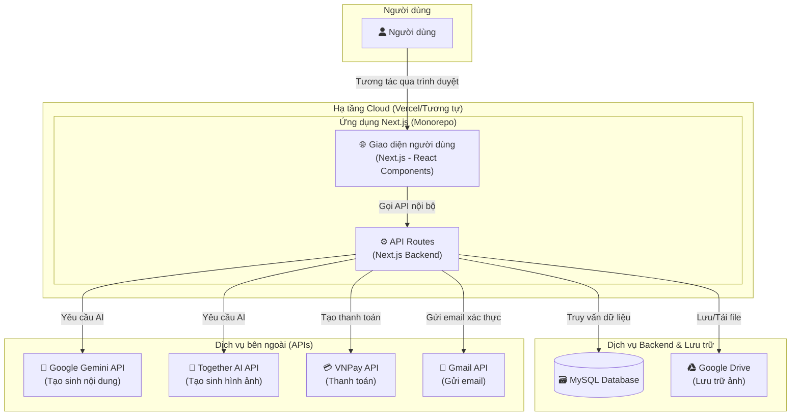

# Tài liệu Kiến trúc Fullstack: ChatStoryAI

## 1. Giới thiệu

Tài liệu này phác thảo kiến trúc kỹ thuật toàn diện cho ứng dụng **ChatStoryAI**. Mục đích của tài liệu này là cung cấp một cái nhìn tổng quan, thống nhất về tất cả các thành phần hệ thống, từ frontend, backend, cơ sở dữ liệu, đến các dịch vụ bên ngoài và quy trình triển khai. Tài liệu này đóng vai trò là nguồn tham khảo chính cho đội ngũ phát triển, đảm bảo tính nhất quán, khả năng bảo trì và mở rộng của dự án.

Đây là bản phân tích kiến trúc của một dự án hiện có (brownfield analysis) nhằm ghi lại cấu trúc hiện tại và đưa ra các đề xuất cải tiến.

### 1.1. Bối cảnh dự án

ChatStoryAI là một nền tảng sáng tạo truyện với sự hỗ trợ của AI, được phát triển bởi nhóm sinh viên DA22TTC - Trường Đại học Trà Vinh. Nền tảng cho phép người dùng tạo và chia sẻ những câu chuyện độc đáo với sự hỗ trợ của các mô hình ngôn ngữ lớn (AI) như Google Gemini và Together AI.

Hệ thống cung cấp các tính năng chính:

- **Sáng tạo với AI**: Tạo ý tưởng truyện, phát triển nhân vật, tạo hội thoại, quản lý chương và đại cương
- **Thư viện truyện**: Đọc truyện đa dạng thể loại với tính năng theo dõi tiến độ
- **Quản lý nội dung**: Tạo và quản lý truyện, nhân vật, chương và cốt truyện
- **Tích hợp thanh toán**: Hỗ trợ gói premium với VNPay
- **API mở**: Cung cấp API key cho các ứng dụng bên ngoài

### 1.2. Nhật ký thay đổi

| Ngày       | Phiên bản | Mô tả                                                    | Tác giả             |
| :--------- | :-------- | :------------------------------------------------------- | :------------------ |
| 25/06/2024 | 1.0       | Phân tích và tạo tài liệu kiến trúc ban đầu từ mã nguồn. | Winston (Architect) |
| 17/07/2025 | 2.0       | Cập nhật phân tích toàn diện dự án và cấu trúc hiện tại. | Winston (Architect) |

## 2. Kiến trúc tổng quan

### 2.1. Tóm tắt kỹ thuật

ChatStoryAI được xây dựng theo kiến trúc **monorepo full-stack** sử dụng **Next.js** với App Router. Kiến trúc này tích hợp chặt chẽ cả frontend và backend trong cùng một codebase, giúp đơn giản hóa việc phát triển và triển khai. Hệ thống sử dụng **MySQL** làm cơ sở dữ liệu quan hệ, **Google Drive** để lưu trữ file, và tích hợp với các dịch vụ AI của **Google Gemini** và **Together AI** để hỗ trợ sáng tạo nội dung. Xác thực người dùng được quản lý bởi **NextAuth.js**.

### 2.2. Nền tảng và Hạ tầng

- **Môi trường Local:** Sử dụng **Docker** và **Docker Compose** để thiết lập một môi trường phát triển nhất quán, bao gồm dịch vụ ứng dụng Next.js và cơ sở dữ liệu MySQL.
- **Hạ tầng triển khai (Dự kiến):** Dựa trên cấu hình `next.config.ts` (`output: 'standalone'`) và các quy trình trong `.github/workflows`, nền tảng triển khai được đề xuất là **Vercel** hoặc một nền tảng Node.js tương tự. Vercel cung cấp khả năng tích hợp liền mạch với Next.js, CI/CD tự động và CDN toàn cầu.
- **Lưu trữ File:** **Google Drive API** được sử dụng để lưu trữ ảnh đại diện và ảnh bìa truyện.
- **Cơ sở dữ liệu:** **MySQL 8.0** được container hóa, đảm bảo tính di động giữa các môi trường.

### 2.3. Sơ đồ kiến trúc tổng quan

Đây là sơ đồ trực quan hóa các thành phần chính và luồng tương tác trong hệ thống ChatStoryAI.



### 2.4. Các mẫu kiến trúc và thiết kế

- **Monorepo Full-stack:** Toàn bộ mã nguồn frontend và backend được quản lý trong cùng một repository, giúp đơn giản hóa việc chia sẻ code (ví dụ: các `types`) và quy trình build.
- **Server Components & Client Components (Next.js App Router):** Tận dụng kiến trúc mới của Next.js để tối ưu hóa hiệu năng, giảm lượng JavaScript gửi về client.
- **API Routes:** Backend được xây dựng dưới dạng các API Route bên trong Next.js, cho phép tạo các endpoint RESTful một cách nhanh chóng.
- **Service Layer:** Logic nghiệp vụ được tách ra khỏi các API handler và đặt trong `src/services` (ví dụ: `AuthService`, `ApiKeyService`), giúp mã nguồn dễ đọc, dễ bảo trì và kiểm thử.
- **Repository Pattern (Implicit):** Việc sử dụng `pool` từ `src/lib/db.ts` trong các services để tương tác với CSDL là một dạng đơn giản của mẫu Repository, trừu tượng hóa việc truy cập dữ liệu.
- **Dual Authentication:** Hỗ trợ cả **Session-based** (cho người dùng web) và **API Key-based** (cho các ứng dụng bên ngoài), mang lại sự linh hoạt cao.

## 3. Ngăn xếp công nghệ (Tech Stack)

### 3.1. Công nghệ chính

| Hạng mục         | Công nghệ    | Phiên bản (từ package.json) | Mục đích                                               |
| :--------------- | :----------- | :-------------------------- | :----------------------------------------------------- |
| **Framework**    | Next.js      | ^15.3.3                     | Xây dựng ứng dụng full-stack, SSR, API routes.         |
| **Ngôn ngữ**     | TypeScript   | ^5                          | Đảm bảo an toàn kiểu dữ liệu và tăng khả năng bảo trì. |
| **Giao diện**    | React        | ^19.0.0                     | Thư viện UI chính.                                     |
| **Styling**      | Tailwind CSS | ^3.4.1                      | Framework CSS Utility-first.                           |
| **Component UI** | shadcn/ui    | ^0.9.4                      | Bộ component UI có khả năng tùy biến cao.              |
| **Database**     | MySQL        | 8.0 (Docker)                | Lưu trữ dữ liệu quan hệ của ứng dụng.                  |
| **Xác thực**     | NextAuth.js  | ^4.24.11                    | Quản lý phiên đăng nhập và OAuth (Google).             |
| **Container**    | Docker       | 3.8 (Compose)               | Đóng gói và chạy ứng dụng, CSDL.                       |

### 3.2. Dịch vụ bên ngoài và API

| Hạng mục          | Công nghệ        | Phiên bản             | Mục đích                                 |
| :---------------- | :--------------- | :-------------------- | :--------------------------------------- |
| **Lưu trữ file**  | Google Drive API | ^144.0.0 (googleapis) | Lưu trữ ảnh bìa và avatar người dùng.    |
| **AI - Văn bản**  | Google Gemini    | ^0.22.0               | Tạo ý tưởng, hội thoại, nội dung truyện. |
| **AI - Hình ảnh** | Together AI      | ^0.13.0               | Tạo ảnh bìa và avatar.                   |
| **Thanh toán**    | VNPay            | ^1.6.1                | Tích hợp cổng thanh toán VNPay.          |
| **Email**         | Nodemailer       | ^6.10.0               | Gửi email (ví dụ: đặt lại mật khẩu).     |
| **Email Client**  | EmailJS          | ^4.4.1                | Gửi email từ client-side.                |

### 3.3. Thư viện hỗ trợ

| Hạng mục          | Công nghệ              | Phiên bản | Mục đích                     |
| :---------------- | :--------------------- | :-------- | :--------------------------- |
| **Tài liệu API**  | Swagger (JSDoc)        | ^6.2.8    | Tự động tạo tài liệu API.    |
| **Markdown**      | React Markdown         | ^10.0.0   | Render markdown content.     |
| **Animation**     | Framer Motion          | ^12.4.7   | Animations và transitions.   |
| **Animation**     | GSAP                   | ^3.12.7   | Advanced animations.         |
| **Icons**         | Lucide React           | ^0.475.0  | Icon library.                |
| **Icons**         | React Icons            | ^5.5.0    | Additional icon sets.        |
| **Date**          | date-fns               | ^4.1.0    | Date manipulation utilities. |
| **Notifications** | Sonner                 | ^2.0.1    | Toast notifications.         |
| **Loading**       | React Loading Skeleton | ^3.5.0    | Loading skeletons.           |
| **Security**      | bcryptjs               | ^3.0.2    | Password hashing.            |

## 4. Mô hình dữ liệu và Schema

### 4.1. Tổng quan Database

Cơ sở dữ liệu MySQL 8.0 được thiết kế để lưu trữ toàn bộ thông tin của ứng dụng với charset `utf8mb4` để hỗ trợ đầy đủ Unicode. Database được khởi tạo thông qua Docker với các file migration trong `docker/mysql/init/`.

### 4.2. Các bảng chính

#### 4.2.1. Quản lý người dùng và xác thực

- **`users`**: Lưu thông tin người dùng (user_id, username, email, user_password, avatar, drive_file_id, has_badge)
- **`api_keys`**: Quản lý API keys cho truy cập bên ngoài với permissions JSON và thời gian hết hạn
- **`reset_codes`**: Mã xác thực đặt lại mật khẩu với thời gian hết hạn

#### 4.2.2. Quản lý truyện và nội dung

- **`stories`**: Bảng trung tâm lưu thông tin truyện (story_id, user_id, title, description, cover_image, status, view_count)
- **`story_chapters`**: Các chương của truyện với `order_number` và `publish_order` riêng biệt
- **`story_characters`**: Thông tin chi tiết nhân vật (name, avatar_image, description, role, gender, personality, appearance, background)
- **`story_outlines`**: Đại cương và dàn ý cho truyện
- **`chapter_dialogues`**: Hội thoại và mô tả trong chương, liên kết với nhân vật
- **`main_categories`, `story_tags`, `story_tag_relations`**: Hệ thống phân loại và gắn thẻ

#### 4.2.3. Tương tác người dùng

- **`story_bookmarks`**: Đánh dấu truyện yêu thích
- **`story_favorites`**: Truyện được yêu thích
- **`view_history`**: Lịch sử xem truyện
- **`chapter_reads`**: Theo dõi chương đã đọc

#### 4.2.4. AI và Chat

- **`ai_chat_history`**: Lịch sử phiên chat với AI
- **`ai_chat_messages`**: Tin nhắn trong phiên chat (role: user/assistant, command_status)
- **`ai_chat_images`**: Hình ảnh được tạo trong chat
- **`ai_generated_dialogues`**: Hội thoại được AI tạo ra

### 4.3. Đánh giá thiết kế Database

**Điểm mạnh:**

- Thiết kế chuẩn với khóa ngoại đảm bảo tính toàn vẹn dữ liệu
- `ON DELETE CASCADE` được sử dụng hợp lý để dọn dẹp dữ liệu liên quan
- Tách `order_number` và `publish_order` trong `story_chapters` cho phép quản lý thứ tự viết và xuất bản độc lập
- Hỗ trợ JSON trong `api_keys.permissions` cho flexibility
- Index được thiết lập hợp lý cho performance

**Cần cải thiện:**

- Thiếu bảng `notifications` mặc dù có API endpoint
- Chưa có bảng `story_outlines` trong schema hiện tại
- Có thể cần thêm soft delete cho một số bảng quan trọng

## 5. Kiến trúc Backend (API Routes)

### 5.1. Tổng quan API Architecture

Backend được xây dựng hoàn toàn bằng API Routes của Next.js, đặt tại `src/app/api` với cấu trúc resource-based routing rất logic và có tổ chức.

### 5.2. Cấu trúc API Endpoints

#### 5.2.1. Authentication & User Management

```
/api/auth/
├── [...nextauth]/          # NextAuth.js endpoints
├── login/                  # Custom login
├── register/               # User registration
├── forgot-password/        # Password reset request
├── verify-reset-code/      # Verify reset code
└── reset-password/         # Reset password

/api/user/
├── api-keys/              # API key management
├── update-avatar/         # Update user avatar
├── update-username/       # Update username
├── update-password/       # Change password
├── update-badge/          # Update badge status
└── delete-account/        # Account deletion
```

#### 5.2.2. Story Management

```
/api/stories/
├── route.ts               # List stories
├── create/                # Create new story
├── featured/              # Featured stories
└── [id]/
    ├── route.ts           # Get/Update/Delete story
    ├── chapters/          # Chapter management
    ├── characters/        # Character management
    ├── outlines/          # Story outlines
    └── dialogues/         # Chapter dialogues
```

#### 5.2.3. Library & Content Discovery

```
/api/library/
├── [id]/                  # Get story details
├── new/                   # New stories
├── popular/               # Popular stories
└── search/                # Search functionality

/api/categories/           # Story categories
```

#### 5.2.4. AI Integration

```
/api/ai/
├── gemini/                # Google Gemini integration
└── chat-history/          # AI chat history

/api/together/
└── key/                   # Together AI key management
```

#### 5.2.5. Other Services

```
/api/account/
├── bookmarks/             # User bookmarks
└── view-history/          # Reading history

/api/notifications/        # Notification system
/api/vnpay/               # Payment integration
/api/subscribe/           # Newsletter subscription
/api/docs/                # API documentation
/api/revalidate/          # Cache revalidation
```

### 5.3. Kiến trúc và Patterns

- **Resource-based Routing:** API được tổ chức theo tài nguyên, dễ hiểu và maintain
- **Dual Authentication:** Hỗ trợ cả session-based (NextAuth) và API key-based authentication
- **Service Layer Pattern:** Logic nghiệp vụ được tách ra khỏi route handlers vào `src/services/`
- **Database Connection Pooling:** Sử dụng connection pool từ `src/lib/db.ts` cho hiệu suất tối ưu
- **Structured Error Handling:** Sử dụng try-catch với JSON response có cấu trúc nhất quán

## 6. Kiến trúc Frontend

### 6.1. Tổng quan Frontend Architecture

Frontend được xây dựng bằng React 19 và Next.js 15 App Router, sử dụng TypeScript để đảm bảo type safety và Tailwind CSS cho styling.

### 6.2. Cấu trúc thư mục và Components

#### 6.2.1. App Router Structure

```
src/app/
├── (pages)/
│   ├── about/             # Trang giới thiệu
│   ├── account/           # Tài khoản người dùng
│   ├── ai/                # AI Assistant
│   ├── contact/           # Liên hệ
│   ├── docs/              # API Documentation
│   ├── guide/             # Hướng dẫn sử dụng
│   ├── library/           # Thư viện truyện
│   ├── payment/           # Thanh toán
│   ├── products/          # Sản phẩm
│   ├── services/          # Dịch vụ
│   ├── settings/          # Cài đặt
│   └── stories/           # Quản lý truyện
├── api/                   # API Routes
├── globals.css            # Global styles
├── layout.tsx             # Root layout
└── page.tsx               # Homepage
```

#### 6.2.2. Component Architecture

```
src/components/
├── ui/                    # Primitive components (shadcn/ui)
│   ├── button.tsx
│   ├── card.tsx
│   ├── input.tsx
│   └── ...
├── ai-generator/          # AI-specific components
├── api-keys/              # API key management
├── login/                 # Authentication components
├── nav/                   # Navigation components
├── story/                 # Story-related components
├── chat-bot.tsx           # AI Chat interface
├── story-card.tsx         # Story display card
├── notification-bell.tsx  # Notifications
└── user-avatar.tsx        # User avatar display
```

### 6.3. State Management và Data Flow

- **Local State:** Chủ yếu sử dụng React hooks (`useState`, `useEffect`, `useReducer`)
- **Context API:** Sử dụng cho shared state như `LoadingProvider`, `SessionProvider`
- **Data Fetching:** Native `fetch` API với custom hooks như `use-debounce.ts`
- **Form Handling:** Controlled components với validation logic
- **Loading States:** Custom `LoadingProvider` để quản lý loading states toàn cục

### 6.4. UI/UX và Styling

- **Design System:** shadcn/ui components với Tailwind CSS
- **Responsive Design:** Mobile-first approach với Tailwind breakpoints
- **Animations:** Framer Motion cho complex animations, GSAP cho advanced effects
- **Icons:** Lucide React và React Icons
- **Typography:** Tailwind Typography plugin cho markdown content
- **Dark Mode:** Hỗ trợ theme switching (nếu có)

### 6.5. Performance Optimizations

- **Server Components:** Sử dụng Next.js Server Components khi có thể
- **Code Splitting:** Automatic với Next.js App Router
- **Image Optimization:** Next.js Image component với Google Drive integration
- **Loading Skeletons:** React Loading Skeleton cho better UX
- **Debouncing:** Custom hook cho search và input optimization

## 7. DevOps và Deployment

### 7.1. Containerization với Docker

Dự án sử dụng Docker để đảm bảo tính nhất quán giữa các môi trường:

```yaml
# docker-compose.yml
services:
  mysql:
    image: mysql:8.0
    environment:
      MYSQL_DATABASE: chatstoryai
      MYSQL_USER: chatstory_user
    volumes:
      - mysql_data:/var/lib/mysql
      - ./docker/mysql/init:/docker-entrypoint-initdb.d

  app:
    build: .
    ports:
      - "3000:3000"
    depends_on:
      mysql:
        condition: service_healthy
```

**Dockerfile** sử dụng multi-stage build với Node.js 20 Alpine để tối ưu kích thước image.

### 7.2. CI/CD Pipeline với GitHub Actions

Dự án có hệ thống CI/CD toàn diện với các workflow:

#### 7.2.1. Continuous Integration (`ci.yml`)

- **Code Quality:** ESLint, TypeScript checking
- **Build Verification:** Next.js build test
- **Security Scanning:** Dependency vulnerability check
- **Automated Testing:** Unit tests (nếu có)

#### 7.2.2. Performance Monitoring (`performance.yml`)

- **Lighthouse Audits:** Tự động đánh giá performance, accessibility, SEO
- **Performance Budgets:** Theo dõi metrics và cảnh báo regression
- **Core Web Vitals:** Monitoring LCP, FID, CLS

#### 7.2.3. Security Pipeline (`security.yml`)

- **Dependency Scanning:** Automated vulnerability detection
- **Secret Detection:** Prevent credential leaks
- **SAST:** Static Application Security Testing
- **License Compliance:** Open source license checking

#### 7.2.4. Deployment (`deploy.yml`)

- **Automated Deployment:** Deploy to production on main branch
- **Environment Management:** Staging và production environments
- **Rollback Capability:** Quick rollback on deployment failures
- **Health Checks:** Post-deployment verification

### 7.3. Environment Configuration

```bash
# Environment Variables
MYSQL_HOST=localhost
MYSQL_PORT=3307
MYSQL_DATABASE=chatstoryai
NEXTAUTH_SECRET=***
GOOGLE_CLIENT_ID=***
GOOGLE_CLIENT_SECRET=***
GEMINI_API_KEY=***
TOGETHER_API_KEY=***
VNP_TMN_CODE=***
VNP_HASH_SECRET=***
```

### 7.4. Deployment Strategy

- **Platform:** Vercel (recommended) hoặc Docker-based deployment
- **Database:** MySQL 8.0 với connection pooling
- **File Storage:** Google Drive API integration
- **CDN:** Next.js automatic optimization + Vercel Edge Network
- **Monitoring:** Built-in analytics với Vercel Analytics và Speed Insights

## 8. Đánh giá và Đề xuất Kiến trúc

### 8.1. Điểm mạnh của kiến trúc hiện tại

**Kiến trúc tổng thể:**

- **Monorepo Full-stack:** Đơn giản hóa development và deployment
- **Modern Tech Stack:** Next.js 15, React 19, TypeScript - công nghệ hiện đại và ổn định
- **Containerization:** Docker setup hoàn chỉnh cho development và production
- **CI/CD Pipeline:** GitHub Actions workflow toàn diện

**Backend Architecture:**

- **Resource-based API:** Cấu trúc API logic và dễ maintain
- **Dual Authentication:** Hỗ trợ cả session và API key authentication
- **Service Layer:** Tách biệt logic nghiệp vụ khỏi API handlers
- **Database Design:** Schema được thiết kế tốt với foreign keys và indexes

**Frontend Architecture:**

- **Component Organization:** Cấu trúc component rõ ràng với shadcn/ui
- **Performance:** Server Components và automatic code splitting
- **Developer Experience:** TypeScript, ESLint, hot reload

### 8.2. Các vấn đề cần cải thiện

#### 8.2.1. Lưu trữ File (Ưu tiên cao)

**Vấn đề hiện tại:**

- Google Drive API không phải giải pháp tối ưu cho static assets
- Có thể gặp rate limiting và performance issues
- Quản lý permissions phức tạp

**Đề xuất:**

- Chuyển sang **Vercel Blob**, **AWS S3**, hoặc **Cloudflare R2**
- Implement CDN cho faster content delivery
- Sử dụng signed URLs cho secure access

#### 8.2.2. Testing Strategy (Ưu tiên cao)

**Vấn đề hiện tại:**

- Thiếu automated testing suite
- Rủi ro regression bugs cao
- Khó maintain code quality khi scale

**Đề xuất:**

```typescript
// Implement testing stack
- Unit Tests: Vitest + React Testing Library
- Integration Tests: API route testing
- E2E Tests: Playwright hoặc Cypress
- Test Coverage: Minimum 80% coverage target
```

#### 8.2.3. State Management (Ưu tiên trung bình)

**Vấn đề hiện tại:**

- Chỉ sử dụng local state và Context API
- Khó share state giữa distant components
- Prop drilling trong một số trường hợp

**Đề xuất:**

- Implement **Zustand** hoặc **Jotai** cho global state
- Maintain React Query/SWR cho server state
- Keep local state cho UI-specific data

#### 8.2.4. Error Handling (Ưu tiên trung bình)

**Vấn đề hiện tại:**

- Error handling không consistent
- Thiếu centralized error logging
- User experience khi có lỗi chưa tối ưu

**Đề xuất:**

```typescript
// Centralized error handler
export class ApiError extends Error {
  constructor(
    public statusCode: number,
    message: string,
    public code?: string
  ) {
    super(message);
  }
}

// Error boundary cho React components
// Structured error responses cho API
```

### 8.3. Đề xuất cải tiến dài hạn

#### 8.3.1. Monitoring và Observability

- Implement **Sentry** cho error tracking
- Add **Prometheus** metrics cho performance monitoring
- Setup **Grafana** dashboards cho system health

#### 8.3.2. Security Enhancements

- Implement **rate limiting** cho API endpoints
- Add **CSRF protection** cho sensitive operations
- Setup **WAF** (Web Application Firewall)
- Regular **security audits** và penetration testing

#### 8.3.3. Performance Optimizations

- Implement **Redis** cho caching layer
- Add **database indexing** optimization
- Setup **CDN** cho static assets
- Implement **lazy loading** cho heavy components

#### 8.3.4. Scalability Considerations

- Consider **microservices** architecture khi cần thiết
- Implement **horizontal scaling** cho database
- Add **load balancing** cho high traffic
- Setup **auto-scaling** infrastructure

## 9. Kết luận

### 9.1. Tóm tắt đánh giá

ChatStoryAI là một dự án được thiết kế và phát triển khá tốt với kiến trúc monorepo full-stack hiện đại. Dự án thể hiện sự hiểu biết sâu sắc về các best practices trong phát triển web, từ việc sử dụng công nghệ tiên tiến như Next.js 15, React 19, TypeScript, đến việc thiết kế database schema hợp lý và tích hợp CI/CD pipeline hoàn chỉnh.

**Điểm nổi bật:**

- Kiến trúc tổng thể rõ ràng và có tổ chức tốt
- Tích hợp AI một cách thông minh và hiệu quả
- Hỗ trợ dual authentication (session + API key)
- Docker containerization hoàn chỉnh
- CI/CD pipeline bài bản với GitHub Actions

### 9.2. Roadmap phát triển

**Phase 1 (Ngắn hạn - 1-2 tháng):**

1. Implement automated testing suite
2. Chuyển đổi file storage từ Google Drive sang Vercel Blob/S3
3. Cải thiện error handling và logging
4. Thêm monitoring cơ bản

**Phase 2 (Trung hạn - 3-6 tháng):**

1. Implement global state management
2. Performance optimization và caching
3. Security enhancements
4. Mobile app development (nếu cần)

**Phase 3 (Dài hạn - 6-12 tháng):**

1. Microservices architecture (nếu cần thiết)
2. Advanced analytics và AI features
3. Scalability improvements
4. International expansion

### 9.3. Khuyến nghị cuối cùng

ChatStoryAI có nền tảng kỹ thuật vững chắc để phát triển thành một nền tảng sáng tạo truyện hàng đầu. Với việc thực hiện các cải tiến được đề xuất, đặc biệt là testing strategy và file storage optimization, dự án sẽ có khả năng scale và maintain tốt hơn trong tương lai.

Đội ngũ phát triển nên tập trung vào việc xây dựng test suite và cải thiện developer experience trước khi mở rộng tính năng. Điều này sẽ đảm bảo chất lượng code và giảm thiểu rủi ro khi phát triển các tính năng mới.

---

_Tài liệu này sẽ được cập nhật định kỳ khi có thay đổi trong kiến trúc hệ thống hoặc khi implement các đề xuất cải tiến._
