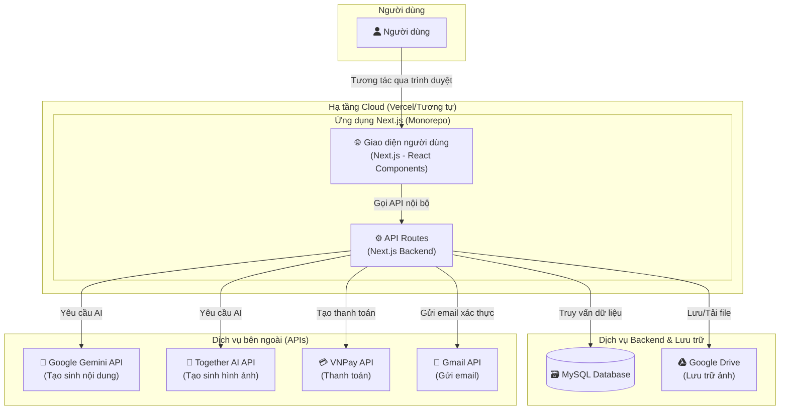

# 2. Kiến trúc tổng quan

### 2.1. Tóm tắt kỹ thuật

ChatStoryAI được xây dựng theo kiến trúc **monorepo full-stack** sử dụng **Next.js** với App Router. Kiến trúc này tích hợp chặt chẽ cả frontend và backend trong cùng một codebase, giúp đơn giản hóa việc phát triển và triển khai. Hệ thống sử dụng **MySQL** làm cơ sở dữ liệu quan hệ, **Google Drive** để lưu trữ file, và tích hợp với các dịch vụ AI của **Google Gemini** và **Together AI** để hỗ trợ sáng tạo nội dung. Xác thực người dùng được quản lý bởi **NextAuth.js**.

### 2.2. Nền tảng và Hạ tầng

- **Môi trường Local:** Sử dụng **Docker** và **Docker Compose** để thiết lập một môi trường phát triển nhất quán, bao gồm dịch vụ ứng dụng Next.js và cơ sở dữ liệu MySQL.
- **Hạ tầng triển khai (Dự kiến):** Dựa trên cấu hình `next.config.ts` (`output: 'standalone'`) và các quy trình trong `.github/workflows`, nền tảng triển khai được đề xuất là **Vercel** hoặc một nền tảng Node.js tương tự. Vercel cung cấp khả năng tích hợp liền mạch với Next.js, CI/CD tự động và CDN toàn cầu.
- **Lưu trữ File:** **Google Drive API** được sử dụng để lưu trữ ảnh đại diện và ảnh bìa truyện.
- **Cơ sở dữ liệu:** **MySQL 8.0** được container hóa, đảm bảo tính di động giữa các môi trường.

### 2.3. Sơ đồ kiến trúc tổng quan

Đây là sơ đồ trực quan hóa các thành phần chính và luồng tương tác trong hệ thống ChatStoryAI.

### 2.4. Các mẫu kiến trúc và thiết kế

- **Monorepo Full-stack:** Toàn bộ mã nguồn frontend và backend được quản lý trong cùng một repository, giúp đơn giản hóa việc chia sẻ code (ví dụ: các `types`) và quy trình build.
- **Server Components & Client Components (Next.js App Router):** Tận dụng kiến trúc mới của Next.js để tối ưu hóa hiệu năng, giảm lượng JavaScript gửi về client.
- **API Routes:** Backend được xây dựng dưới dạng các API Route bên trong Next.js, cho phép tạo các endpoint RESTful một cách nhanh chóng.
- **Service Layer:** Logic nghiệp vụ được tách ra khỏi các API handler và đặt trong `src/services` (ví dụ: `AuthService`, `ApiKeyService`), giúp mã nguồn dễ đọc, dễ bảo trì và kiểm thử.
- **Repository Pattern (Implicit):** Việc sử dụng `pool` từ `src/lib/db.ts` trong các services để tương tác với CSDL là một dạng đơn giản của mẫu Repository, trừu tượng hóa việc truy cập dữ liệu.
- **Dual Authentication:** Hỗ trợ cả **Session-based** (cho người dùng web) và **API Key-based** (cho các ứng dụng bên ngoài), mang lại sự linh hoạt cao.

