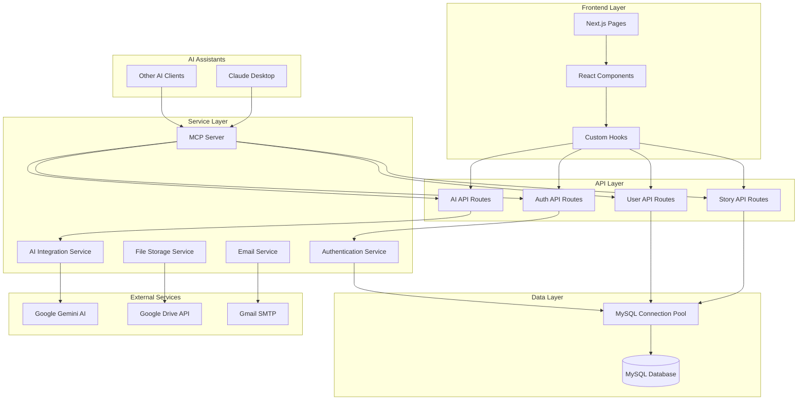

# Components

## Core Application Components

Dựa trên kiến trúc Next.js và phân tích codebase, hệ thống được tổ chức thành các component chính:

### Web Application Layer

**Responsibility:** Frontend user interface và user experience

**Key Interfaces:**

- React components với TypeScript
- Next.js App Router pages
- Client-side state management với React hooks
- Responsive design với TailwindCSS

**Dependencies:** React, Next.js, TailwindCSS, Radix UI

**Technology Stack:** Next.js 15.3.3, React 19.0.0, TypeScript 5.x

### API Layer

**Responsibility:** Backend business logic và data processing

**Key Interfaces:**

- RESTful API endpoints trong `/api` routes
- Request/response handling với NextResponse
- Authentication middleware
- Data validation và error handling

**Dependencies:** Next.js API routes, NextAuth.js, MySQL connection pool

**Technology Stack:** Next.js API Routes, NextAuth.js 4.24.11

### Authentication Service

**Responsibility:** User authentication và session management

**Key Interfaces:**

- NextAuth.js configuration
- Google OAuth provider
- Credentials provider cho local accounts
- Session management và JWT tokens

**Dependencies:** NextAuth.js, Google OAuth, MySQL user table

**Technology Stack:** NextAuth.js 4.24.11, Google OAuth 2.0

### Database Access Layer

**Responsibility:** Data persistence và query execution

**Key Interfaces:**

- MySQL connection pool
- Direct SQL queries với mysql2
- Transaction management
- Connection pooling và error handling

**Dependencies:** MySQL 8.0, mysql2 driver

**Technology Stack:** MySQL 8.0, mysql2 3.12.0

### AI Integration Service

**Responsibility:** AI-powered content generation

**Key Interfaces:**

- Google Gemini API integration
- Prompt engineering và response processing
- Streaming responses cho real-time chat
- Content moderation và safety settings

**Dependencies:** Google Gemini API, custom prompt templates

**Technology Stack:** Google Gemini 2.5-flash, @google/generative-ai 0.22.0

### File Storage Service

**Responsibility:** File upload và storage management

**Key Interfaces:**

- Google Drive API integration
- File upload/download operations
- Image processing và optimization
- Access control và sharing permissions

**Dependencies:** Google Drive API, Google Service Account

**Technology Stack:** Google Drive API v3, googleapis 144.0.0

### Email Service

**Responsibility:** Transactional email delivery

**Key Interfaces:**

- Gmail SMTP integration
- Email template rendering
- Delivery status tracking
- Error handling và retry logic

**Dependencies:** Gmail SMTP, nodemailer

**Technology Stack:** Gmail SMTP, nodemailer 6.10.0

### MCP Server

**Responsibility:** AI assistant integration qua Model Context Protocol

**Key Interfaces:**

- MCP protocol implementation
- Tool registration và execution
- API proxy cho ChatStoryAI endpoints
- Authentication và authorization forwarding

**Dependencies:** @modelcontextprotocol/sdk, axios, zod

**Technology Stack:** MCP SDK 1.12.0, TypeScript 5.8.3, Node.js 20.x

## Component Diagrams

