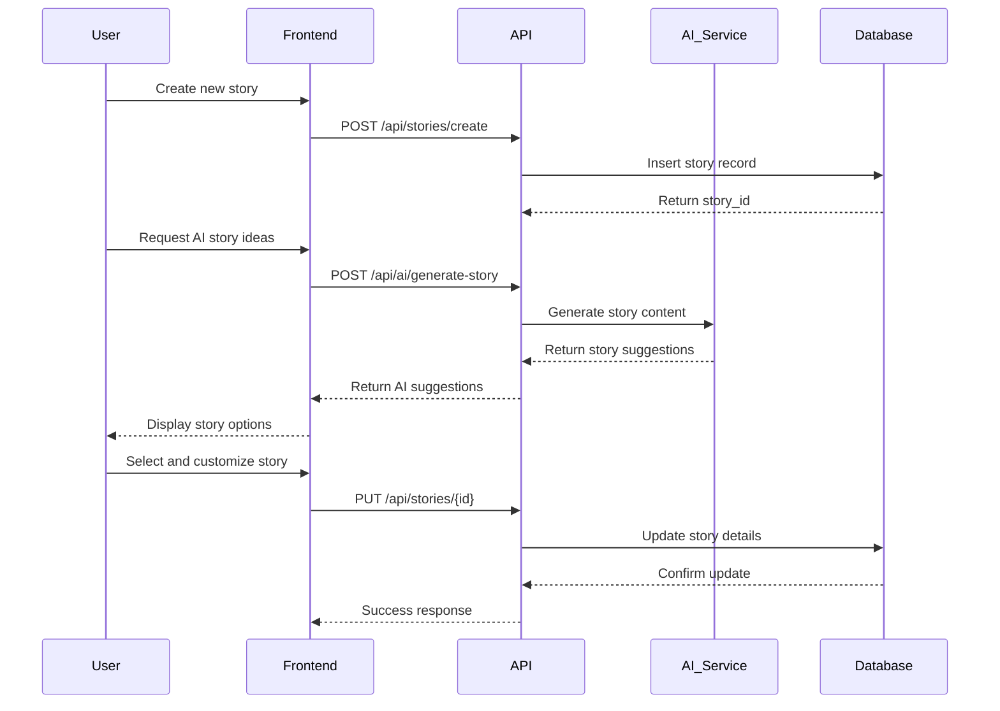
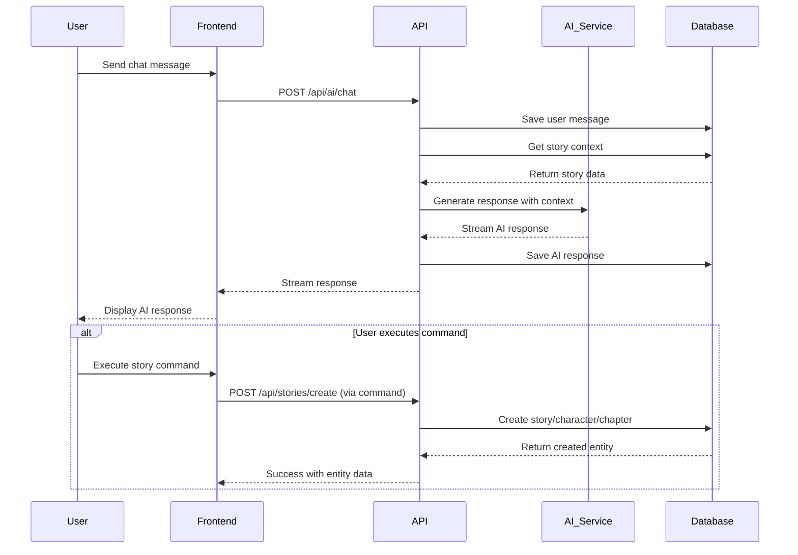
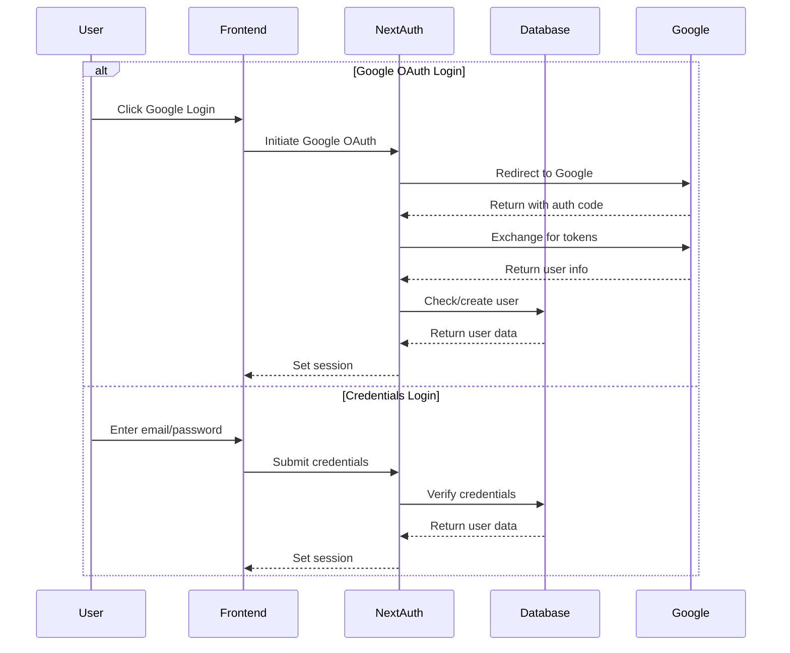
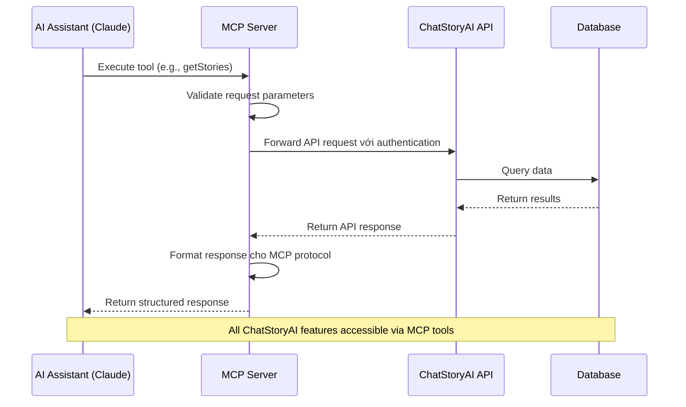

# Core Workflows

## Story Creation Workflow

```mermaid
sequenceDiagram
    participant User
    participant Frontend
    participant API
    participant AI_Service
    participant Database

    User->>Frontend: Create new story
    Frontend->>API: POST /api/stories/create
    API->>Database: Insert story record
    Database-->>API: Return story_id

    User->>Frontend: Request AI story ideas
    Frontend->>API: POST /api/ai/generate-story
    API->>AI_Service: Generate story content
    AI_Service-->>API: Return story suggestions
    API-->>Frontend: Return AI suggestions
    Frontend-->>User: Display story options

    User->>Frontend: Select and customize story
    Frontend->>API: PUT /api/stories/{id}
    API->>Database: Update story details
    Database-->>API: Confirm update
    API-->>Frontend: Success response
```

## AI Chat Workflow

```mermaid
sequenceDiagram
    participant User
    participant Frontend
    participant API
    participant AI_Service
    participant Database

    User->>Frontend: Send chat message
    Frontend->>API: POST /api/ai/chat
    API->>Database: Save user message
    API->>Database: Get story context
    Database-->>API: Return story data

    API->>AI_Service: Generate response with context
    AI_Service-->>API: Stream AI response
    API->>Database: Save AI response
    API-->>Frontend: Stream response
    Frontend-->>User: Display AI response

    alt User executes command
        User->>Frontend: Execute story command
        Frontend->>API: POST /api/stories/create (via command)
        API->>Database: Create story/character/chapter
        Database-->>API: Return created entity
        API-->>Frontend: Success with entity data
    end
```

## User Authentication Workflow

```mermaid
sequenceDiagram
    participant User
    participant Frontend
    participant NextAuth
    participant Database
    participant Google

    alt Google OAuth Login
        User->>Frontend: Click Google Login
        Frontend->>NextAuth: Initiate Google OAuth
        NextAuth->>Google: Redirect to Google
        Google-->>NextAuth: Return with auth code
        NextAuth->>Google: Exchange for tokens
        Google-->>NextAuth: Return user info
        NextAuth->>Database: Check/create user
        Database-->>NextAuth: Return user data
        NextAuth-->>Frontend: Set session
    else Credentials Login
        User->>Frontend: Enter email/password
        Frontend->>NextAuth: Submit credentials
        NextAuth->>Database: Verify credentials
        Database-->>NextAuth: Return user data
        NextAuth-->>Frontend: Set session
    end
```

## MCP Integration Workflow

```mermaid
sequenceDiagram
    participant AI_Assistant as AI Assistant (Claude)
    participant MCP_Server as MCP Server
    participant API as ChatStoryAI API
    participant Database

    AI_Assistant->>MCP_Server: Execute tool (e.g., getStories)
    MCP_Server->>MCP_Server: Validate request parameters
    MCP_Server->>API: Forward API request với authentication
    API->>Database: Query data
    Database-->>API: Return results
    API-->>MCP_Server: Return API response
    MCP_Server->>MCP_Server: Format response cho MCP protocol
    MCP_Server-->>AI_Assistant: Return structured response

    Note over AI_Assistant,Database: All ChatStoryAI features accessible via MCP tools
```
