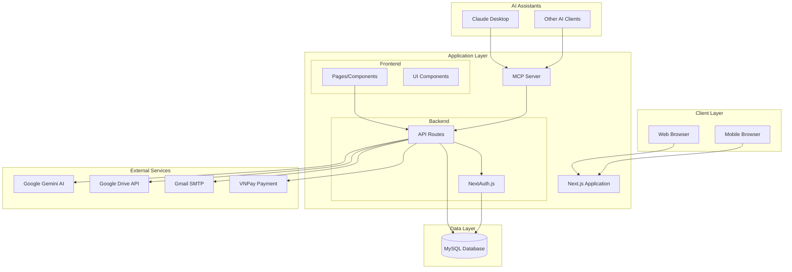

# High Level Architecture

## Technical Summary

ChatStoryAI sử dụng kiến trúc **Monolithic Full-Stack với MCP Integration** với Next.js làm framework chính, tích hợp AI services để tạo nội dung truyện tự động. Hệ thống bao gồm frontend React, API routes tích hợp, MCP Server cho AI assistant integration, MySQL database, và các external services (Google Gemini AI, Google Drive). Kiến trúc này hỗ trợ các mục tiêu PRD về việc tạo truyện với AI, quản lý nội dung, và chia sẻ cộng đồng thông qua một platform thống nhất và dễ bảo trì, đồng thời cho phép tương tác qua AI assistants như Claude Desktop.

## High Level Overview

1. **Architectural Style**: **Monolithic Full-Stack Application với MCP Integration**

   - Single Next.js application handling both frontend và backend
   - API routes tích hợp trong cùng codebase
   - MCP Server cho AI assistant integration
   - Shared components và utilities

2. **Repository Structure**: **Monorepo với MCP Extension**

   - Single repository chứa toàn bộ application
   - Organized theo Next.js App Router structure
   - Separate MCP server trong `/mcp` directory
   - Shared types và utilities trong `src/lib`

3. **Service Architecture**: **Monolithic với External Services và MCP Layer**

   - Core application logic trong Next.js
   - MCP Server cho AI assistant integration (Claude Desktop, etc.)
   - External AI services (Google Gemini)
   - External storage (Google Drive API)
   - MySQL database cho persistent data

4. **User Interaction Flow**:

   - User authentication qua NextAuth.js (Google OAuth + Credentials)
   - Story creation và management qua web interface
   - AI-powered content generation qua integrated chat
   - Real-time collaboration features

5. **Key Architectural Decisions**:
   - **Next.js Full-Stack**: Simplifies deployment và development
   - **MySQL**: Relational data phù hợp với story/character relationships
   - **Google Gemini**: Advanced AI capabilities cho content generation
   - **Docker**: Containerized deployment cho consistency

## High Level Project Diagram

## Architectural and Design Patterns

- **Full-Stack Monolith với MCP Integration**: Next.js application với integrated API routes và MCP Server - _Rationale:_ Đơn giản hóa development và deployment, đồng thời mở rộng khả năng tích hợp với AI assistants
- **Model Context Protocol (MCP)**: Standardized protocol cho AI assistant integration - _Rationale:_ Cho phép AI assistants như Claude Desktop tương tác trực tiếp với hệ thống qua giao thức chuẩn
- **Repository Pattern**: Abstraction layer cho database access - _Rationale:_ Tách biệt business logic khỏi data access, dễ testing và maintenance
- **Service Layer Pattern**: Tách biệt business logic thành services - _Rationale:_ Tổ chức code tốt hơn, reusability cao
- **API-First Design**: RESTful APIs với OpenAPI documentation - _Rationale:_ Hỗ trợ future mobile apps và third-party integrations
- **Event-Driven UI**: React state management với hooks - _Rationale:_ Responsive UI với real-time updates
- **Authentication Middleware**: NextAuth.js cho session management - _Rationale:_ Secure và standardized authentication flow
